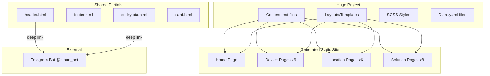

# Design Document: Pipun VPN Website

## Overview

Pipun VPN Website — статический многостраничный сайт-витрина для VPN-сервиса. Сайт построен на Hugo (генератор статических сайтов) с SCSS для стилей и mobile-first подходом. Все CTA-кнопки ведут в Telegram-бота с deep linking параметрами для аналитики.

Ключевые принципы:
- Hugo для шаблонизации и генерации страниц
- SCSS для модульных стилей с переменными
- Нет backend-логики, только статический контент
- Все платежи и управление подпиской — через Telegram-бота
- Единый шаблон для внутренних страниц (устройства/локации/решения)
- Cyberpunk Lite дизайн с неоновыми акцентами

## Architecture



### Структура файлов Hugo

```
pipun-vpn/
├── hugo.toml                    # Конфигурация Hugo
├── content/
│   ├── _index.md                # Главная страница
│   ├── devices/
│   │   ├── _index.md            # Список устройств (опционально)
│   │   ├── iphone.md
│   │   ├── android.md
│   │   ├── windows.md
│   │   ├── macos.md
│   │   ├── android-tv.md
│   │   └── apple-tv.md
│   ├── locations/
│   │   ├── turkey.md
│   │   ├── kazakhstan.md
│   │   ├── argentina.md
│   │   ├── usa.md
│   │   ├── germany.md
│   │   └── netherlands.md
│   └── solutions/
│       ├── instagram.md
│       ├── youtube.md
│       ├── steam.md
│       ├── ps-store.md
│       ├── canva.md
│       ├── adobe.md
│       ├── midjourney.md
│       └── ai.md
├── data/
│   ├── pricing.yaml             # Тарифы
│   └── faq.yaml                 # FAQ вопросы
├── layouts/
│   ├── _default/
│   │   ├── baseof.html          # Базовый шаблон
│   │   └── single.html          # Шаблон внутренней страницы
│   ├── index.html               # Шаблон главной страницы
│   └── partials/
│       ├── header.html
│       ├── footer.html
│       ├── sticky-cta.html
│       ├── hero.html
│       ├── pricing-card.html
│       ├── device-card.html
│       ├── solution-card.html
│       └── faq.html
├── assets/
│   └── scss/
│       ├── main.scss            # Главный файл стилей
│       ├── _variables.scss      # Переменные (цвета, шрифты)
│       ├── _base.scss           # Базовые стили
│       ├── _components.scss     # Компоненты (кнопки, карточки)
│       └── _layout.scss         # Layout (header, footer, grid)
└── static/
    └── js/
        └── main.js              # FAQ accordion, mobile menu
```

## Components and Interfaces

### SCSS Variables (_variables.scss)

```scss
// Цвета
$color-bg-dark: #0f0f0f;
$color-bg-card: rgba(31, 31, 31, 0.5);
$color-border: #2a2a2a;
$color-accent: #ff00ff;
$color-accent-light: #ff66ff;
$color-text: #ffffff;
$color-text-muted: #9ca3af;
$color-success: #4ade80;

// Градиенты
$gradient-accent: linear-gradient(135deg, #ec4899, #d946ef);

// Шрифты
$font-family: 'Inter', -apple-system, BlinkMacSystemFont, sans-serif;

// Размеры
$container-max: 1200px;
$border-radius: 1rem;
$border-radius-full: 9999px;

// Breakpoints
$breakpoint-md: 768px;
$breakpoint-lg: 1024px;
```

### Hugo Config (hugo.toml)

```toml
baseURL = "https://pipun.vpn/"
languageCode = "ru"
title = "Pipun VPN"
theme = ""

[params]
  botUrl = "https://t.me/pipun_bot"
  supportUrl = "https://t.me/pipunhelper"

[markup.goldmark.renderer]
  unsafe = true
```

### Header Partial (layouts/partials/header.html)

```html
<header class="header">
  <nav class="header__nav container">
    <a href="{{ "/" | relURL }}" class="header__logo">
      <span class="header__logo-icon">🛡️</span>
      <span class="header__logo-text">Pipun VPN</span>
    </a>
    
    <div class="header__menu">
      <a href="{{ "/#devices" | relURL }}" class="header__link">Устройства</a>
      <a href="{{ "/#locations" | relURL }}" class="header__link">Локации</a>
      <a href="{{ "/#faq" | relURL }}" class="header__link">Помощь</a>
    </div>
    
    <a href="{{ .Site.Params.botUrl }}?start=web_header" class="btn btn--accent">
      Войти в бота
    </a>
    
    <button class="header__burger" id="mobile-menu-btn" aria-label="Меню">☰</button>
  </nav>
</header>
```

### Footer Partial (layouts/partials/footer.html)

```html
<footer class="footer">
  <div class="container footer__inner">
    <div class="footer__logo">
      <span>🛡️</span>
      <span>Pipun VPN</span>
    </div>
    
    <div class="footer__links">
      <a href="{{ .Site.Params.supportUrl }}" target="_blank">Поддержка</a>
      <a href="{{ "/offer/" | relURL }}">Оферта</a>
      <a href="{{ "/privacy/" | relURL }}">Политика</a>
    </div>
    
    <p class="footer__tagline">Работает на стелс-протоколах</p>
  </div>
</footer>
```

### Sticky CTA Partial (layouts/partials/sticky-cta.html)

```html
{{ if .Params.deeplink }}
<div class="sticky-cta">
  <a href="{{ .Site.Params.botUrl }}?start={{ .Params.deeplink }}" class="btn btn--accent btn--full">
    Получить ключ в Telegram
  </a>
</div>
{{ end }}
```

### Content Front Matter Example (content/devices/iphone.md)

```yaml
---
title: "VPN для iPhone"
description: "Быстрое подключение в одно касание. Работает с iOS 14+"
icon: "📱"
headline: "VPN для iPhone"
benefit: "Быстрое подключение в одно касание. Работает с iOS 14+"
appName: "Streisand"
deeplink: "web_iphone"
type: "device"
---
```

### Single Page Template (layouts/_default/single.html)

```html
{{ define "main" }}
<main class="page">
  <!-- Hero -->
  <section class="hero hero--inner">
    <span class="hero__icon">{{ .Params.icon }}</span>
    <h1 class="hero__title">{{ .Params.headline }}</h1>
    <p class="hero__subtitle">{{ .Params.benefit }}</p>
  </section>
  
  <!-- Instructions -->
  <section class="instructions">
    <h2 class="instructions__title">Как начать</h2>
    <div class="instructions__steps">
      <div class="step">
        <span class="step__number">1</span>
        <p class="step__text">Перейдите в бота и оплатите подписку</p>
      </div>
      <div class="step">
        <span class="step__number">2</span>
        <p class="step__text">Скачайте приложение <strong>{{ .Params.appName | default "приложение" }}</strong></p>
      </div>
      <div class="step">
        <span class="step__number">3</span>
        <p class="step__text">Вставьте ссылку из бота в приложение</p>
      </div>
    </div>
  </section>
  
  <!-- Desktop CTA -->
  <section class="cta-section">
    <a href="{{ .Site.Params.botUrl }}?start={{ .Params.deeplink }}" class="btn btn--accent btn--large">
      Получить ключ в Telegram
    </a>
  </section>
</main>
{{ end }}
```

### Data File Example (data/pricing.yaml)

```yaml
plans:
  - duration: "1 Неделя"
    price: 149
    discount: null
    popular: false
  - duration: "1 Месяц"
    price: 289
    discount: null
    popular: true
  - duration: "3 Месяца"
    price: 789
    discount: "-10%"
    popular: false
  - duration: "6 Месяцев"
    price: 1489
    discount: "-15%"
    popular: false
  - duration: "12 Месяцев"
    price: 2689
    discount: "-25%"
    popular: false
```

### Pricing Section in Home Template

```html
<section class="pricing" id="pricing">
  <h2 class="section-title">Тарифы</h2>
  <div class="pricing__grid">
    {{ range .Site.Data.pricing.plans }}
    <div class="pricing-card {{ if .popular }}pricing-card--popular{{ end }}">
      {{ if .popular }}<span class="pricing-card__badge">🔥 ХИТ</span>{{ end }}
      <h3 class="pricing-card__duration">{{ .duration }}</h3>
      <p class="pricing-card__price">{{ .price }} <span>RUB</span></p>
      {{ if .discount }}<span class="pricing-card__discount">{{ .discount }}</span>{{ end }}
      <a href="{{ $.Site.Params.botUrl }}?start=web_pricing" class="btn btn--accent">Купить</a>
    </div>
    {{ end }}
  </div>
  <p class="pricing__note">Принимаем карты РФ и Крипту в боте</p>
</section>
```

## Data Models

### Page Content (Front Matter)

```yaml
# Общие поля для всех внутренних страниц
title: string          # SEO title
description: string    # SEO description
icon: string           # Emoji иконка
headline: string       # Заголовок на странице
benefit: string        # Текст выгоды
deeplink: string       # Параметр deep link (web_iphone, web_turkey, etc.)
type: string           # device | location | solution

# Дополнительные поля
appName: string        # Для устройств — название приложения
focus: string          # Для локаций/решений — фокус (Steam, Xbox, etc.)
```

### Device Pages Content

```yaml
# content/devices/iphone.md
title: "VPN для iPhone"
icon: "📱"
headline: "VPN для iPhone"
benefit: "Быстрое подключение в одно касание. Работает с iOS 14+"
appName: "Streisand"
deeplink: "web_iphone"

# content/devices/android.md
title: "VPN для Android"
icon: "🤖"
headline: "VPN для Android"
benefit: "Поддержка всех версий Android 7+. Минимальный расход батареи"
appName: "v2rayNG"
deeplink: "web_android"

# content/devices/windows.md
title: "VPN для Windows"
icon: "💻"
headline: "VPN для Windows"
benefit: "Работает на Windows 10/11. Автозапуск при старте системы"
appName: "Nekoray"
deeplink: "web_windows"

# content/devices/macos.md
title: "VPN для macOS"
icon: "🍎"
headline: "VPN для macOS"
benefit: "Нативная поддержка Apple Silicon и Intel Mac"
appName: "Streisand"
deeplink: "web_macos"

# content/devices/android-tv.md
title: "VPN для Android TV"
icon: "📺"
headline: "VPN для Android TV"
benefit: "Для Sony, Xiaomi и других приставок. Стриминг без буферизации"
appName: "v2rayNG"
deeplink: "web_android-tv"

# content/devices/apple-tv.md
title: "VPN для Apple TV"
icon: "🍏"
headline: "VPN для Apple TV"
benefit: "Поддержка tvOS 17+. 4K стриминг без ограничений"
appName: "Streisand"
deeplink: "web_apple-tv"
```

### Location Pages Content

```yaml
# content/locations/turkey.md
title: "VPN Турция"
icon: "🇹🇷"
headline: "VPN для Steam и PS Store Турция"
benefit: "Покупай игры дешевле. Турецкие цены в Steam и PlayStation Store"
focus: "Steam, PS Store"
deeplink: "web_turkey"

# content/locations/kazakhstan.md
title: "VPN Казахстан"
icon: "🇰🇿"
headline: "VPN Казахстан"
benefit: "Доступ к казахстанским сервисам и контенту"
deeplink: "web_kazakhstan"

# content/locations/argentina.md
title: "VPN Аргентина"
icon: "🇦🇷"
headline: "VPN для Xbox Аргентина"
benefit: "Самые низкие цены на Xbox Game Pass и игры"
focus: "Xbox"
deeplink: "web_argentina"

# content/locations/usa.md
title: "VPN США"
icon: "🇺🇸"
headline: "VPN США"
benefit: "Доступ к американским сервисам и стримингу"
deeplink: "web_usa"

# content/locations/germany.md
title: "VPN Германия"
icon: "🇩🇪"
headline: "VPN Германия"
benefit: "Европейские серверы с минимальным пингом"
deeplink: "web_germany"

# content/locations/netherlands.md
title: "VPN Нидерланды"
icon: "🇳🇱"
headline: "VPN Нидерланды"
benefit: "Быстрые серверы в центре Европы"
deeplink: "web_netherlands"
```

### Solution Pages Content

```yaml
# content/solutions/instagram.md
title: "VPN для Instagram"
icon: "📸"
headline: "VPN для Instagram"
benefit: "Обход блокировки Instagram. Стабильное соединение для Stories и Reels"
deeplink: "web_instagram"

# content/solutions/youtube.md
title: "VPN для YouTube"
icon: "▶️"
headline: "VPN для YouTube 4K"
benefit: "Смотри YouTube без ограничений скорости. 4K стриминг без буферизации"
focus: "4K стриминг"
deeplink: "web_youtube"

# content/solutions/steam.md
title: "VPN для Steam"
icon: "🎮"
headline: "VPN для Steam"
benefit: "Смена региона Steam. Покупай игры по ценам других стран"
focus: "Смена региона"
deeplink: "web_steam"

# content/solutions/ps-store.md
title: "VPN для PS Store"
icon: "🎯"
headline: "VPN для PlayStation Store"
benefit: "Доступ к турецкому и другим региональным PS Store"
deeplink: "web_ps-store"

# content/solutions/canva.md
title: "VPN для Canva"
icon: "🎨"
headline: "VPN для Canva"
benefit: "Полный доступ к Canva Pro функциям без ограничений"
deeplink: "web_canva"

# content/solutions/adobe.md
title: "VPN для Adobe"
icon: "🖌️"
headline: "VPN для Adobe"
benefit: "Доступ к Adobe Creative Cloud без региональных ограничений"
deeplink: "web_adobe"

# content/solutions/midjourney.md
title: "VPN для Midjourney"
icon: "🤖"
headline: "VPN для Midjourney"
benefit: "Генерируй изображения с AI без блокировок"
deeplink: "web_midjourney"

# content/solutions/ai.md
title: "VPN для AI"
icon: "🧠"
headline: "VPN для ChatGPT и Claude"
benefit: "Доступ к ChatGPT, Claude и другим AI-сервисам"
deeplink: "web_ai"
```

### Pricing Data (data/pricing.yaml)

```yaml
plans:
  - duration: "1 Неделя"
    price: 149
    discount: null
    popular: false
  - duration: "1 Месяц"
    price: 289
    discount: null
    popular: true
  - duration: "3 Месяца"
    price: 789
    discount: "-10%"
    popular: false
  - duration: "6 Месяцев"
    price: 1489
    discount: "-15%"
    popular: false
  - duration: "12 Месяцев"
    price: 2689
    discount: "-25%"
    popular: false
```

### FAQ Data (data/faq.yaml)

```yaml
items:
  - question: "Как платить?"
    answer: "Оплата происходит через Telegram-бота. Принимаем карты российских банков и криптовалюту."
  - question: "Сложно настроить?"
    answer: "Нет! После оплаты бот пришлёт ссылку. Просто скопируйте её в приложение — и готово. Настройка занимает 2 минуты."
```


## Correctness Properties

*A property is a characteristic or behavior that should hold true across all valid executions of a system—essentially, a formal statement about what the system should do. Properties serve as the bridge between human-readable specifications and machine-verifiable correctness guarantees.*

### Property 1: Header and Footer Consistency

*For any* page in the website, the page SHALL contain:
- Header with logo "Pipun VPN"
- Navigation menu with items: Устройства, Локации, Помощь
- CTA button "Войти в бота" in header
- Footer with links: Поддержка, Оферта, Политика
- Footer text "Работает на стелс-протоколах"

**Validates: Requirements 1.1, 1.2, 1.3, 1.5, 1.6**

### Property 2: Card Navigation Correctness

*For any* device card on the home page, clicking the card SHALL navigate to the corresponding device page at `/{device-slug}.html`.

*For any* solution card on the home page, clicking the card SHALL navigate to the corresponding solution page at `/{solution-slug}.html`.

**Validates: Requirements 3.2, 4.2**

### Property 3: Card Content Completeness

*For any* card (device or solution) on the home page, the card SHALL display both an icon and a name.

**Validates: Requirements 3.3, 4.3**

### Property 4: Inner Page Structure Consistency

*For any* inner page (device, location, or solution), the page SHALL contain:
- Hero section with page-specific headline
- Main benefit text
- Instruction block with exactly 3 numbered steps
- Sticky CTA button "Получить ключ в Telegram" (visible on mobile)
- Desktop CTA button (visible on desktop)

**Validates: Requirements 7.2, 7.3, 7.4, 7.5, 8.2, 8.3, 8.4, 8.5, 9.2, 9.3, 9.4, 9.5**

### Property 5: Deep Link Format Correctness

*For any* CTA button on any page, the href attribute SHALL match the format `https://t.me/pipun_bot?start=web_{source}` where `{source}` is a valid source identifier.

**Validates: Requirements 10.1, 10.2**

### Property 6: Deep Link Source Uniqueness

*For any* two different pages, their deep link source parameters SHALL be unique (no duplicates).

**Validates: Requirements 10.3**

### Property 7: Pricing Cards Display

*For any* pricing card, the card SHALL display:
- Duration text
- Price in RUB
- Discount label (if applicable)
- "ХИТ" badge for popular plan
- CTA button linking to Telegram bot

**Validates: Requirements 5.2, 5.3, 5.4, 5.5, 5.6, 5.8**

### Property 8: Semantic HTML Validity

*For any* page in the website, the HTML SHALL be valid according to W3C HTML5 specification with no critical errors.

**Validates: Requirements 12.1**

## Error Handling

### 404 Page Not Found

Если пользователь переходит на несуществующую страницу, сервер должен вернуть страницу 404 с:
- Сообщением "Страница не найдена"
- Кнопкой возврата на главную
- Сохранением общего стиля сайта (header/footer)

### Broken Deep Links

Все deep links должны быть статическими и проверенными. Если Telegram-бот недоступен, пользователь увидит стандартное сообщение Telegram.

### Mobile Menu Fallback

Если JavaScript отключен, мобильное меню должно быть скрыто, но основные ссылки в footer остаются доступными.

### Image Loading

Используются emoji-иконки вместо изображений для гарантированной загрузки без внешних зависимостей.

## Testing Strategy

### Unit Tests

Unit-тесты для проверки конкретных примеров и edge cases:

1. **Home Page Content Tests**
   - Проверка наличия всех 5 тарифов с правильными ценами
   - Проверка наличия всех 6 карточек устройств
   - Проверка наличия всех 8 карточек решений
   - Проверка FAQ accordion функциональности

2. **Navigation Tests**
   - Проверка работы мобильного меню
   - Проверка всех ссылок в header и footer

3. **Deep Link Tests**
   - Проверка формата deep link для header CTA
   - Проверка deep link для hero CTA
   - Проверка deep link для pricing cards

### Property-Based Tests

Property-based тесты для проверки универсальных свойств:

1. **Property 1 Test**: Header/Footer Consistency
   - Генерировать список всех страниц сайта
   - Для каждой страницы проверить наличие header и footer элементов
   - Минимум 100 итераций (все 21 страница × несколько проверок)

2. **Property 4 Test**: Inner Page Structure
   - Генерировать список всех inner pages (20 страниц)
   - Для каждой проверить наличие hero, benefit, instructions, CTA
   - Проверить что instructions содержит ровно 3 шага

3. **Property 5 Test**: Deep Link Format
   - Собрать все CTA кнопки со всех страниц
   - Проверить что каждый href соответствует формату
   - Использовать regex: `^https://t\.me/pipun_bot\?start=web_[a-z0-9-]+$`

4. **Property 6 Test**: Deep Link Uniqueness
   - Собрать все source параметры со всех страниц
   - Проверить отсутствие дубликатов

### Testing Framework

- **HTML Validation**: W3C Validator API или html-validate
- **Link Testing**: Playwright или Puppeteer для проверки навигации
- **Property Tests**: Jest с custom matchers для DOM проверок

### Test Configuration

```javascript
// jest.config.js
module.exports = {
  testEnvironment: 'jsdom',
  testMatch: ['**/*.test.js'],
  collectCoverage: true,
  coverageThreshold: {
    global: {
      branches: 80,
      functions: 80,
      lines: 80
    }
  }
};
```

### Test Annotation Format

Каждый property-based тест должен быть аннотирован:

```javascript
/**
 * Feature: pipun-vpn-website
 * Property 5: Deep Link Format Correctness
 * Validates: Requirements 10.1, 10.2
 */
test.prop([allPages], (page) => {
  // test implementation
});
```
